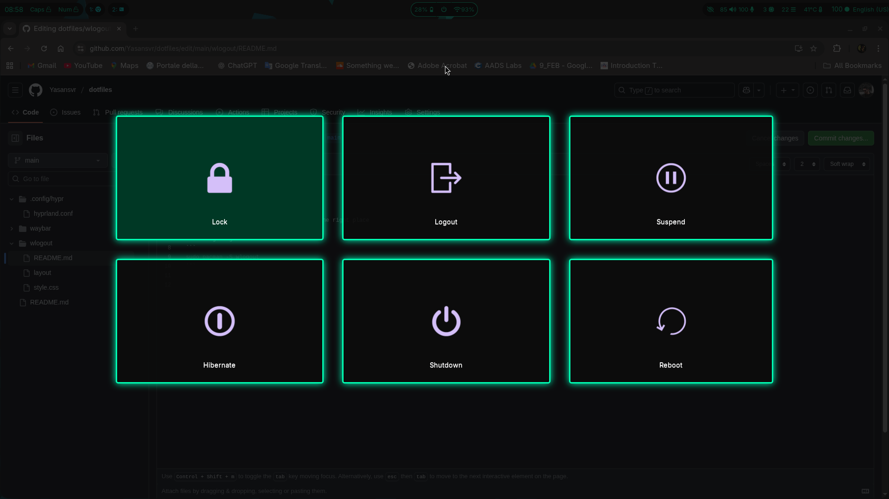

These are wlogout configs and css code. 
I used them for waybar power menu. 

install it before using!
and make sure that the files located in the right place 

~/.config/wlogout/

sudo pacman -S wlogout 

